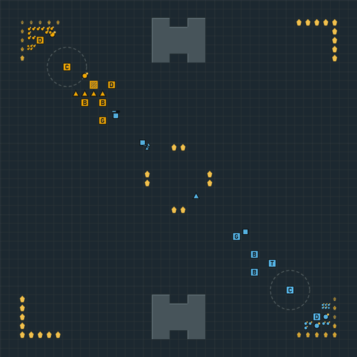
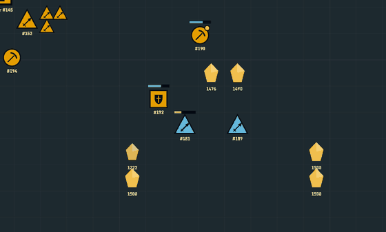
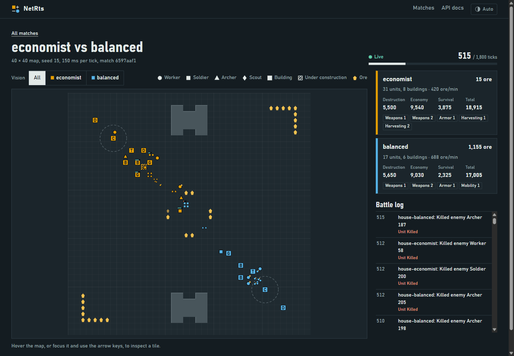
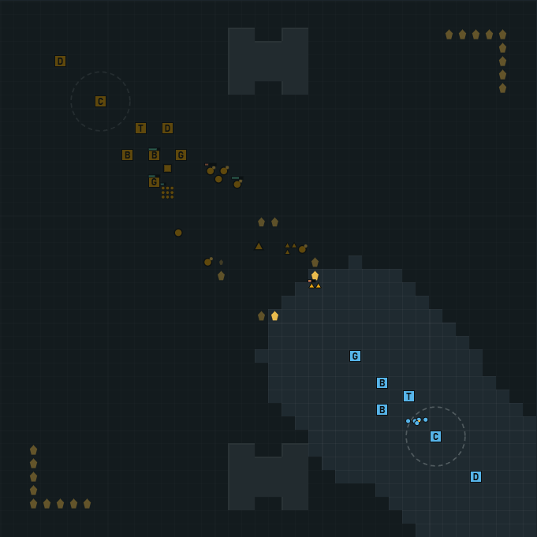
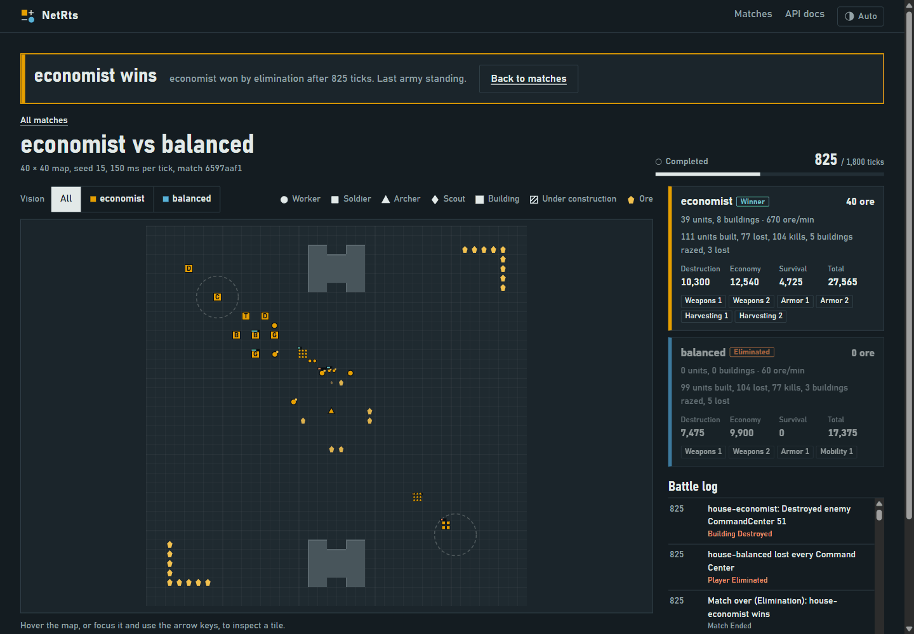
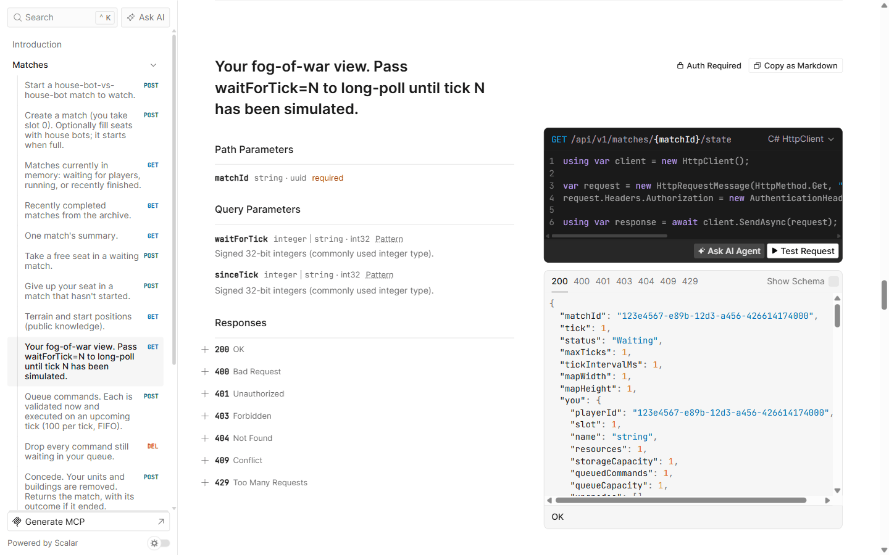
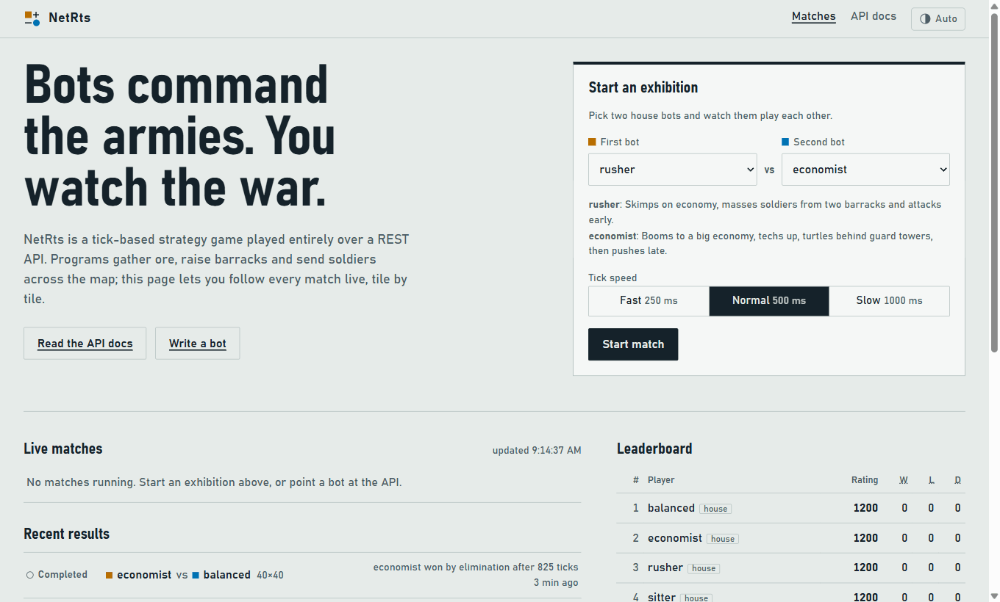

<h1 align="center">🦡 Badger Brawl</h1>

<p align="center"><strong>Write the bot. Command the badgers. Watch them brawl.</strong><br>
<sub>A Snow College bot-programming game · Ephraim, Utah · Est. 1888 · Go Badgers!</sub></p>

<p align="center">
  <a href="https://github.com/SnowSE/NetRTS/actions/workflows/ci.yaml"></a>
  <a href="https://hub.docker.com/r/snowcollege/netrts"></a>
</p>

<p align="center">
  
</p>

**Badger Brawl is a real-time strategy game where nobody touches a mouse.** You write a program,
in any language that speaks HTTP, and it runs a clan of Snow College Badgers: sending diggers
after grubs, moving into the Suites at Academy Square, signing up for Organic Chemistry and Code
Review in the GRSC Makerspace, and marching soldiers and archers across the Sanpete Valley at the
other team's Noyes Building. Every second the world ticks forward; your bot sees what its badgers can
see and decides what to do next.
Then you sit back and watch it win (or work out why it didn't).

Built by and for Snow College Software Engineering students, for programming competitions,
classrooms and anyone who has ever wanted to settle "my strategy is better than yours" with code.

## Why Noyes? Why Academy Square?

Snow College is named for Lorenzo and Erastus Snow, [not the weather](https://snow.edu/offices/administration/historical-sketch.html).
It opened in 1888 as Sanpete Stake Academy, with its first 150 students meeting upstairs in
Ephraim's Co-op Store, and Newton E. Noyes kept it alive through its lean early years; the Noyes
Building, the oldest on campus, still carries his name. So in Badger Brawl every team defends a
different campus building, lives in different student housing, and drops its grubs at the Co-op
Store.

## Your code is the head badger

Orders are plain JSON, and they say what you mean. The API uses classic RTS names (a Digger is a
`Worker`, Anderson Hall is a `Barracks`), so every bot library and tutorial still applies:

```jsonc
{ "commands": [
  { "type": "Gather",  "units": "all", "unitType": "Worker", "targetId": 4 },          // diggers, go dig up those grubs
  { "type": "Build",   "unitIds": [31], "buildingType": "Barracks", "x": 12, "y": 9 }, // move into housing here
  { "type": "Produce", "buildingId": 77, "unitType": "Soldier", "count": 3 },          // three soldiers, please
  { "type": "Attack",  "units": "5-40", "x": 56, "y": 56 }                             // everyone: charge!
] }
```

## Meet the clan, see the campus

| On the field | In the API | What it does |
|---|---|---|
| 🦡 **Digger** | `Worker` | Digs up grubs and puts up buildings. |
| ⚔️ **Soldier** | `Soldier` | Tough, close-up. |
| 🏹 **Archer** | `Archer` | Shoots from four tiles away. |
| 👃 **Scout** | `Scout` | Twice as fast, and sniffs out the enemy furthest off. |
| 🏛️ **HQ** | `CommandCenter` | Each team's own campus building: the **Noyes Building**, **Greenwood Student Center**, **Eccles Center**, **Huntsman Library** and on through 16 seats. Lose your last one and you're out. |
| 🏠 **Housing** | `Barracks` | Each team's own address: **Suites at Academy Square**, **Anderson Hall**, **Mary Nielson Hall**, **Snow Hall**, then the Ephraim apartments. Trains soldiers, archers and scouts. |
| 🧺 **Co-op Store** | `ResourceDepot` | A closer place to drop grubs off, and room to store more. |
| 🧪 **GRSC Makerspace** | `TechLab` | Coursework: Intro to Chemistry → Organic Chemistry, Unit Testing → Code Review, Algorithms → Parallel Computing, Intro to Biology → Entomology. |
| 🗼 **Guard Tower** | `GuardTower` | Shoots anything that wanders too close. |

Four kinds of badger, five buildings, eight upgrades, and a rule set small enough to learn in an
afternoon, with plenty of strategy hiding in it: rush early, out-dig the opponent, turtle behind
guard towers, out-study them, or scout their campus and strike where they're weak.

## Zoom into the brawl

<p align="center">
  
</p>

The live spectator page streams every brawl tick by tick. Scroll or pinch to zoom, and the map
switches from a strategic overview to an illustrated close-up of the Sanpete Valley: claw-marked
diggers, striped badger soldiers, archers' arrows, scouts' paw prints, campus halls flying a
pennant, lit-up dorms, makerspace flasks and guard towers, with health bars and build progress. Hit
**Follow the brawl** and the camera chases the biggest fight on its own.
It fills whatever screen you give it, from a phone to a wall-sized monitor, in Snow College blue,
white and orange, light or dark. Prefer plain RTS? The **Original theme** button in the top bar
switches the whole site back to the classic NetRts look (ore, Command Centers, barracks), and
remembers your choice.

<p align="center">
  
</p>

## Fog of war that's actually fair



Your bot sees only what its badgers see. The server enforces this; it isn't a polite request to
the client. Enemy orders are never revealed, ids of unseen badgers can't be probed, and buildings
you scouted earlier are remembered for you. Maps are generated from a seed with mirror symmetry, so
every starting campus is exactly as good as every other.

Spectators can flip to any team's view to see the brawl the way that bot saw it.

<br clear="right">

## Every brawl ends with a box score

<p align="center">
  
</p>

Take the last enemy HQ, or have the higher score at the final whistle. Results break down into
destruction, economy and survival, feed an Elo ladder of Top Badgers, and come with a full replay:
the engine is deterministic, so a seed plus the command log reproduces any brawl exactly.

## Four house badgers to scrimmage

| House badger | API name | Plays like |
|---|---|---|
| **Sleepy Sitter** | `sitter` | Digs grubs and never fights back. Your first win. |
| **Honey Badger** | `rusher` | Doesn't care. Two dorms' worth of soldiers early, attacks before you're ready. |
| **Blue Badger** | `balanced` | Steady economy, mixed team, upgrades, attacks in waves. |
| **Grub Hoarder** | `economist` | Out-digs everyone, hides behind guard towers, arrives late with an enormous clan. |

Beat the Sleepy Sitter in your first hour. Beating the Grub Hoarder takes a real plan.

## An API that documents itself

<p align="center">
  
</p>

Every endpoint, schema and error code is browsable at `/scalar`, with ready-made code samples and
a "Test Request" button that uses your API key. The docs walk you from first request to a bot that
wins, in **C# or Python**: pick a language on any example and the rest follow.

## Start in five minutes

You need the [.NET 10 SDK](https://dotnet.microsoft.com/download/dotnet/10.0).

```bash
git clone https://github.com/SnowSE/NetRTS && cd NetRTS
dotnet run --project src/NetRts.Server
```

Or skip the SDK and run the image:

```bash
docker run -p 8080:8080 -v badger-data:/home/app snowcollege/netrts
```

Open **http://localhost:5080** (or :8080 for Docker) and start a scrimmage between two house
badgers. Then put your own bot on the field from another terminal:

```bash
dotnet run --project src/NetRts.BotRunner -- --server http://localhost:5080 --name eph-the-badger --strategy rusher --vs sitter
python samples/python/bot.py --server http://localhost:5080 --name my-python-badger
```

With no database configured the server keeps players and results in a local SQLite file. With
Docker installed, `aspire run` starts it against PostgreSQL with the Aspire dashboard, and the same
setup deploys to Azure (App Service plus a private PostgreSQL) with `azd up`.

<p align="center">
  
</p>

## Documentation

| For | Read |
|---|---|
| New players, first five minutes | [docs/getting-started.md](docs/getting-started.md): one page |
| New players, first bot | [docs/tutorial/](docs/tutorial/README.md): step by step in C# or Python, with screenshots |
| Reference (and the field guide of campus names) | [docs/bot-guide.md](docs/bot-guide.md): every command, rule, stat and error code |
| Teaching / contributors | [docs/how-it-works.md](docs/how-it-works.md): guided tour of the back end, with exercises |
| Hosting | [docs/deploying.md](docs/deploying.md): local Aspire and Azure deployment |
| Maintainers | [docs/architecture.md](docs/architecture.md), [docs/requirements-coverage.md](docs/requirements-coverage.md) |

## Under the hood

The code still lives under its original `NetRts` project names.

| Path | What it is |
|---|---|
| `src/NetRts.Engine` | The game: map generation, rules, pathfinding, the tick simulation, fog-of-war views, replays. Pure, deterministic C#. |
| `src/NetRts.Protocol` | JSON contract shared by the server, SDK and bots. |
| `src/NetRts.Server` | ASP.NET Core host: API keys, matchmaking, tick loops, long-poll state, live spectator stream, Elo, the spectator site. |
| `src/NetRts.Server/wwwroot/lore.js` | The Snow College vocabulary: every name the spectator site shows. |
| `src/NetRts.Bots` | C# SDK (`NetRtsClient`, `BotLoop`) and the house badgers. |
| `src/NetRts.BotRunner` | Command-line runner for any house-badger strategy. |
| `src/NetRts.AppHost`, `src/NetRts.ServiceDefaults` | .NET Aspire: local orchestration, Azure deployment, telemetry. |
| `samples/python` | Standalone Python reference bot. |
| `tests/` | Engine and API tests, including whole bot-vs-bot brawls and replay determinism. |
| `specs/001-rts-game-engine` | The original specification; [docs/requirements-coverage.md](docs/requirements-coverage.md) maps it to the code. |

```bash
dotnet build
dotnet test
```

See [CONTRIBUTING.md](CONTRIBUTING.md) to join the team.

## License

MIT. Go Badgers! 🦡
