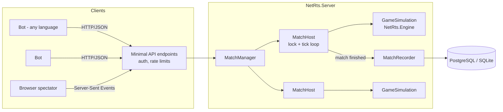
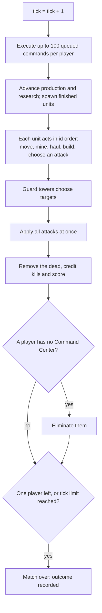

# How Badger Brawl Works — a guided tour of the back end

This guide explains the server behind Badger Brawl for teaching: each section introduces a general
idea, shows how Badger Brawl applies it, points at the code, and ends with questions and exercises.
It assumes you can read C#; you don't need to know ASP.NET Core beforehand.

**Contents**

1. [The big picture](#1-the-big-picture)
2. [A simulation is a function: determinism](#2-a-simulation-is-a-function-determinism)
3. [The game loop: one tick](#3-the-game-loop-one-tick)
4. [Commands: validate twice, queue once](#4-commands-validate-twice-queue-once)
5. [Movement: grids, A* and movement points](#5-movement-grids-a-and-movement-points)
6. [Fog of war](#6-fog-of-war)
7. [Simultaneous combat](#7-simultaneous-combat)
8. [Procedural maps that are fair](#8-procedural-maps-that-are-fair)
9. [Concurrency: one lock per match](#9-concurrency-one-lock-per-match)
10. [Long polling and server-sent events](#10-long-polling-and-server-sent-events)
11. [Authentication with API keys](#11-authentication-with-api-keys)
12. [Protecting the server: limits](#12-protecting-the-server-limits)
13. [Persistence, replays and Elo ratings](#13-persistence-replays-and-elo-ratings)
14. [Bots as clients and as house players](#14-bots-as-clients-and-as-house-players)
15. [Testing a game](#15-testing-a-game)
16. [Project ideas](#16-project-ideas)

---

## 1. The big picture



The code is split by **responsibility**, not by technical layer:

| Project | Responsibility | Depends on |
|---|---|---|
| `NetRts.Protocol` | The JSON contract: records like `CommandRequest`, `GameStateDto`. | nothing |
| `NetRts.Engine` | The game itself: rules, map, pathfinding, ticks, fog of war, scoring, replays. | Protocol |
| `NetRts.Bots` | An HTTP client SDK and the built-in bot strategies. | Protocol |
| `NetRts.Server` | Hosting: HTTP, auth, matchmaking, timers, database. | Engine, Bots |

The most important design decision is that **the engine knows nothing about the web**. It doesn't
know what HTTP, threads, clocks or databases are. That makes it easy to test, easy to reason
about, and reusable — the same engine runs inside the server, inside unit tests, and in the replay
viewer.

> **Discuss:** the first version of this project used "Clean Architecture" layers (Domain,
> Application, Infrastructure, Api) with a mediator library between them, but game logic leaked
> across all of them and it never became playable. What is the difference between organising code
> by *layer* and by *responsibility*? When is each appropriate?

## 2. A simulation is a function: determinism

A match is a pure function of its inputs:

```text
final state = simulate(config, seed, players, [commands queued at each tick])
```

If you run it twice with the same inputs you get the same result, bit for bit. This property is
called **determinism**, and it buys a lot:

- **Replays** need only the seed and the commands, not a recording of every frame
  (`GameSimulation.GetReplay` / `GameSimulation.FromReplay`).
- **Bugs reproduce.** A crash report plus a replay recreates the exact situation.
- **Fairness can be checked.** Anyone can re-run a tournament match and confirm the result.

Determinism is easy to lose by accident. Badger Brawl avoids these traps:

| Trap | Why it breaks determinism | What Badger Brawl does |
|---|---|---|
| `System.Random` | Its algorithm may change between .NET versions. | Its own SplitMix64 generator (`Engine/Rng.cs`). |
| Reading the clock | Wall time differs every run. | The engine only knows the tick number. |
| Iterating a `HashSet`/`Dictionary` | Order is unspecified. | Entities live in lists kept in id order. |
| Ambiguous ties ("nearest enemy") | Two equally near enemies → arbitrary pick. | Explicit tie-breaks: distance, then HP, then id. |
| Floating point | Can differ across CPUs and compiler settings. | Integer maths throughout (speeds are "tenths of a tile"). |

The test `FullMatchTests.Replaying_a_match_reproduces_it_exactly` plays a whole bot-vs-bot match,
replays it, and compares `StateHash()` of both runs.

> **Exercise:** add `DateTime.Now.Millisecond % 2` as a tie-breaker somewhere in
> `FindEnemy` and run the replay test. Then explain the failure.

## 3. The game loop: one tick

Real-time games split time into discrete steps. Badger Brawl uses a **fixed timestep** of one tick per
second by default, and `GameSimulation.Step()` (`Engine/GameSimulation.Tick.cs`) performs one:



The order is a **rule of the game** — bots depend on it. For example, commands run *before*
movement, so a Move submitted between ticks takes effect on the very next tick.

The tick rate is a trade-off. Faster ticks feel more "real-time" but give bots less thinking
time and raise network and CPU load; slower ticks make the game more turn-based. Competitions use
1 s; the tests use 10–50 ms.

> **Questions:** Why are units processed in id order rather than, say, player order? What could
> go wrong if player 0's units always moved first?

## 4. Commands: validate twice, queue once

Bots send batches of commands (`POST /matches/{id}/commands`). Each command is:

1. **Validated immediately** (`GameSimulation.Submit` → `Validate(strict: true)`): is the JSON
   meaningful, do you own those units, is the position on the map, can you afford it? The bot gets
   a per-command `accepted`/`rejected` answer with an error code straight away.
2. **Queued** in the player's FIFO queue (capacity 500).
3. **Validated again** when the tick executes it (`ExecuteQueuedCommands` →
   `Validate(strict: false)`), because the world may have changed: the ore was spent, the unit
   died, the target walked into the fog. A failure here becomes a `CommandFailed` *event* tagged
   with the command's id.

Two validation passes may look redundant, but each answers a different question. The first says
"is this request sensible?" (fast feedback for the bot author); the second says "is it still
possible?" (correctness).

Commands don't move units directly. They set a unit's **order** (`OrderKind.Move`, `Gather`,
`Build`, …), and the unit carries out that order over many ticks. This is a small **state
machine** per unit. A new command simply replaces the order, which is why "the most recent command
wins" without any special code.

> **Exercise:** add a `Patrol` command (walk back and forth between two points, attacking
> anything seen). You'll touch `CommandType` (Protocol), `Validate`, `Apply`, `OrderKind` and
> `UpdateUnit`. Write the test first in `CommandTests`.

## 5. Movement: grids, A* and movement points

The world is a grid of tiles. Rock, buildings and ore deposits block movement; units may share
tiles (which avoids traffic-jam logic a beginner bot can't handle).

**Pathfinding** is A* search (`Engine/Pathfinder.cs`):

- 8-directional moves, each costing 1, so distance is **Chebyshev** distance
  (`max(|dx|, |dy|)`), which is also the heuristic. It never overestimates, so A* finds shortest
  paths.
- Diagonal moves may not "cut the corner" of a blocked tile.
- The priority queue orders by `(f, h, insertion order)`. The last element makes ties
  deterministic.
- If the goal is unreachable, the path leads to the reachable tile *closest* to it. A unit
  ordered into a rock wall walks up to the wall and stops.
- The goal can be a *range* ("any tile within 1 of the deposit"), which is how workers stand next
  to ore and archers stop at range 4.

**Speed** uses integer *movement points*: each tick a unit gains `speed` points (10 = one tile per
tick) and spends 10 per tile stepped. A Scout (speed 20) steps twice per tick, and a unit with
speed 14 alternates between one and two tiles. Upgrades just add points. No floating point is
needed.

Paths are cached on the unit and re-planned only when the goal moves noticeably or the next tile
becomes blocked. Re-running A* for every unit every tick would work, but it is wasted effort.

> **Questions:** Why is Chebyshev distance the right heuristic here, and why would Manhattan
> distance be wrong? What would change if diagonal steps cost 1.4?

## 6. Fog of war

Each player sees only tiles within the **vision radius** of their units and buildings
(Euclidean — circles look natural). `ComputeVisibility` stamps a filled circle for each entity
onto a `bool[width × height]` grid. The grid is cached and rebuilt once per tick.

Fog is enforced **on the server**, in `GetPlayerView`. The response simply omits enemy entities on
fogged tiles. This is the only safe approach: anything sent to a client can be read by that
client, so a "hide it in the UI" approach is worthless in a programming contest.

Subtler leaks are blocked too:

- Enemy orders (`targetId`, `destination`) and enemy production queues are never sent.
- Attacking an unseen id returns `TARGET_NOT_FOUND` — the same error as a nonexistent id — so bots
  can't probe ids to discover hidden units.

> **Exercise:** add an "explored" layer (tiles you've ever seen, shown as remembered terrain). Where
> must that state live, and how does it affect `StateHash` and replays?

## 7. Simultaneous combat

If attacks were applied one at a time, the unit processed first would get a free hit — a hidden
advantage determined by id numbers. Badger Brawl resolves combat in two phases:

1. **Decide:** every unit and tower that can attack adds an `Attack(attacker, target, damage)` to
   a list. Nobody's HP changes yet.
2. **Resolve:** apply all damage, then remove everything at or below 0 HP.

So two soldiers on 5 HP who hit each other both die
(`CombatAndVictoryTests.Attacks_in_the_same_tick_land_simultaneously`). Damage is
`max(1, damage + weapon upgrades − armor − armor upgrades)`. The minimum of 1 means armor can
never make something invulnerable.

Kill credit (for the destruction score) goes to the attacker whose hit took the target from alive
to dead. Because the list order is deterministic, so is the credit.

## 8. Procedural maps that are fair

`MapGenerator` builds a different map for every seed, but competitive maps must be fair. The trick
is **symmetry**: generate only the top-left quadrant, then mirror every feature into the other
three. Every start position is then identical up to reflection: same ore, same distances, same
obstacles.

Random rock blobs could seal a base in or cut off ore. After placing them, the generator runs a
breadth-first flood fill from a start position and checks that every other start, and a tile next
to every deposit, is reachable. If not, it retries with the generator's next random numbers (still
deterministic), falling back to an open map.

> **Questions:** Mirroring in both axes gives 4-way symmetry. For a 2-player map, is 180° rotation
> fairer, less fair, or the same? (Hint: think about which way each player's ore field faces.)

## 9. Concurrency: one lock per match

The server is multi-threaded. Several HTTP requests for the same match may arrive at once, and a
timer thread ticks the match in the background. `GameSimulation` is deliberately **not**
thread-safe, so something must make sure two threads never touch it simultaneously.

`MatchHost` (`Server/Matches/MatchHost.cs`) wraps each simulation and acquires `lock (_gate)`
around *every* access: submitting commands, building a view, ticking. Consequences:

- A bot can never observe half a tick (units moved but combat not yet resolved).
- Different matches don't share a lock, so ten matches tick in parallel.
- Work inside the lock is short (microseconds to a few milliseconds). Database writes happen
  outside it, in `MatchRecorder`, so a slow database can never stall a game.

The first version of this project had API threads and the tick thread editing the same lists with
no locking. That is a classic **race condition**: it works in testing and corrupts state under
load.

> **Discuss:** why a coarse lock per match instead of fine-grained locks per unit, or lock-free
> structures? What is the cost? When would you change your mind?

## 10. Long polling and server-sent events

A bot needs to know when a new tick happens. It could poll every 50 ms, but that wastes requests
and still adds latency. Badger Brawl offers two **push-style** techniques over plain HTTP.

**Long polling** — `GET /state?waitForTick=N`. The server doesn't answer until tick N exists (or a
timeout passes). Inside `MatchHost`:

```csharp
// one TaskCompletionSource per tick: completing it wakes every waiter at once
Task signal;
lock (_gate)
{
    signal = _tickSignal.Task;               // grab the signal FIRST...
    if (_sim.Tick >= tick) return;           // ...then check the condition
}
await signal.WaitAsync(timeout);
```

The order matters. If you checked the tick *before* grabbing the signal, a tick could complete in
the gap and you'd sleep through it — the **lost wake-up** bug. After each tick, `Signal()` swaps in
a fresh `TaskCompletionSource` and completes the old one.

**Server-sent events (SSE)** — `GET /spectate/stream` keeps one response open and writes a
`data: {json}` line per tick. Browsers support it natively with `EventSource`. It's one-way
(server → client), which is all a spectator needs, and it's simpler than WebSockets.

> **Exercise:** measure it. Write a bot that busy-polls `/state` every 50 ms and count requests per
> match versus the long-polling `BotLoop`.

## 11. Authentication with API keys

Bots are long-running programs, not people at a login form, so Badger Brawl uses **API keys**:

- `POST /players` generates 32 random bytes (`RandomNumberGenerator`) → `nrts_…`, returns it
  **once**, and stores only its **SHA-256 hash**. A stolen database doesn't reveal usable keys.
  A fast hash is fine here, unlike for passwords, because the key is high-entropy random data,
  not something a human chose.
- `ApiKeyAuthenticationHandler` hashes the `Authorization: Bearer` value, looks it up (with an
  in-memory cache), and sets the request's user identity. Endpoints then call `user.PlayerId()`.
- **Authorization** is separate from authentication: knowing *who* you are isn't enough; every
  game endpoint also checks you are *seated in that match* (`NOT_A_PARTICIPANT`).

The first version accepted an `X-Test-Player-Id` header in production, so anyone could act as
anyone. Test conveniences must never ship enabled.

## 12. Protecting the server: limits

A competition server is shared by people actively trying to win, so every resource has a limit:

| Limit | Where | Protects against |
|---|---|---|
| 30 requests/s per bot per match, 120/s per bot overall (token buckets) | `RateLimits.cs` | Request floods |
| 5 registrations/min per IP | `RateLimits.cs` | Name squatting, spam accounts |
| 256 KB request body, 100 commands per request | Kestrel, `GameConfig` | Memory exhaustion |
| 500 queued commands, 100 executed per tick | `GameConfig` | One bot hogging the tick |
| Long poll ≤ 30 s | `NetRtsOptions` | Unbounded open connections |
| 50 live matches, 4 exhibitions, 3 waiting per player | `MatchManager` | Running out of CPU |
| Selector ranges ≤ 100 000 wide | `ParseSelector` | "1-2000000000" CPU bombs |

Every error has the same `{code, message}` shape. Expected client mistakes aren't logged as server
errors, so they don't flood the logs.

## 13. Persistence, replays and Elo ratings

**What is stored?** Very little: players (name, key hash, rating, wins/losses/draws) and finished
matches (summary, result and replay as JSON text). Live match state is never written to the
database. It changes every second and can be rebuilt from a replay anyway.

**When?** When a match ends, `MatchHost` raises `Completed` and `MatchRecorder` takes it off a
`Channel` (an async producer/consumer queue) on its own background thread. The tick loop never
waits for the database.

**Which database?** EF Core with PostgreSQL when the Aspire AppHost supplies a `netrtsdb`
connection string (a container locally, Azure Database for PostgreSQL in production), or SQLite for
plain `dotnet run` and tests. In Azure the connection string has no password: the server proves
its identity with an Azure managed identity (Microsoft Entra ID). The provider is
chosen at startup in `Program.cs`. Nothing else in the code knows which one it is.

**Elo** (`Server/Data/Elo.cs`): each player has a rating, and the expected score of A against B is
`1 / (1 + 10^((Rb − Ra)/400))`. After a game both ratings move by `K × (actual − expected)` with
K = 32. Beating a stronger player gains more than beating a weaker one. Only player-vs-player 1v1
matches are rated, so nobody can farm rating by beating the passive house bot.

> **Exercise:** the leaderboard query sorts by rating. With 10 000 players, which index does it
> need, and is it there? (See `NetRtsDb.OnModelCreating`.)

## 14. Bots as clients and as house players

`NetRts.Bots` contains:

- `NetRtsClient` — a typed HTTP client over the REST API.
- `BotLoop.RunAsync` — the standard *wait → decide → submit* loop.
- `IBotStrategy` — `Decide(state, map, rules) → commands`.
- `PlanBot` — one data-driven strategy engine. `rusher`, `economist`, `balanced` and `sitter` are
  the same code with different `BotPlan`s (worker target, build order, army mix, attack
  threshold).

The same strategy objects run in two places. Over HTTP via the runner, they are ordinary bots.
Inside the server as **house bots**, `MatchHost` calls `Decide` just before each tick and submits
through the *same validation path*. House bots therefore can't cheat (they see only their
fog-of-war view), and every server test that uses one also exercises the real command pipeline.

## 15. Testing a game

Games have a reputation for being hard to test. Determinism makes Badger Brawl easy to test:

- **Scenario tests** (`tests/NetRts.Engine.Tests`): `GameSimulation.Testing.cs` exposes internal
  hooks to place units, set HP or grant upgrades. A test can stage "a soldier next to a worker with
  1 HP" in two lines, step one tick, and assert the result. About 60 such tests run in a few
  seconds.
- **Whole-game tests:** `FullMatchTests` plays the house bots against each other to completion. If
  a balance change makes matches stall or a bot stop working, these fail.
- **Property tests:** "every map is mirror-symmetric" over several seeds and sizes; "replay
  reproduces the match exactly".
- **API tests** (`tests/NetRts.Server.Tests`): the real HTTP pipeline (`WebApplicationFactory`)
  over a throwaway SQLite file. The tick loop is switched off so tests advance ticks by hand
  (`MatchHost.Advance`), which removes timing flakiness. One class runs the real timer and plays
  a whole match over HTTP.

> **Discuss:** the first version's tests failed because they waited 2.5 s for a background timer
> to tick. Why are tests that `sleep` and hope fragile? What did this version do instead?

## 16. Project ideas

Small (rally points, income per minute and remembered enemy buildings started on this list and are
now in the game — read `SendToRally`, `IncomeWindow` and `UpdateMemories` as worked examples):
- A `CancelProduction` command that removes the last queued unit and refunds its cost.
- Draw a line from each building to its rally point in the spectator map.
- Add each player's commands per minute (accepted and failed) to the match result.

Medium:
- A new unit (e.g. a healer or siege unit) — rules, stats, tests, bot-guide entry.
- A `GET /replay/{id}/tick/{n}` endpoint that re-simulates to tick *n* for the spectator.
- A Swiss-system tournament runner using `POST /matches` and the results endpoint.

Large:
- Scale out: route each match to one of several server processes (consistent hashing on match
  id) and keep the match list in the database.
- Terrain types that slow movement (A* with non-uniform costs).
- A WebSocket transport alongside REST — and an experiment comparing its latency with long
  polling.
