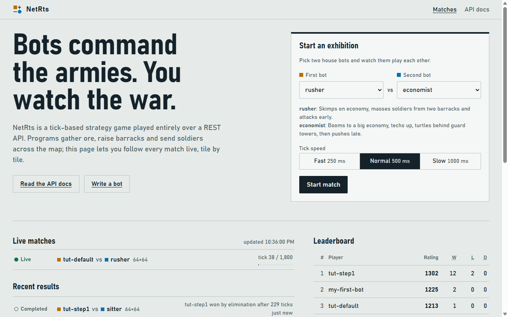
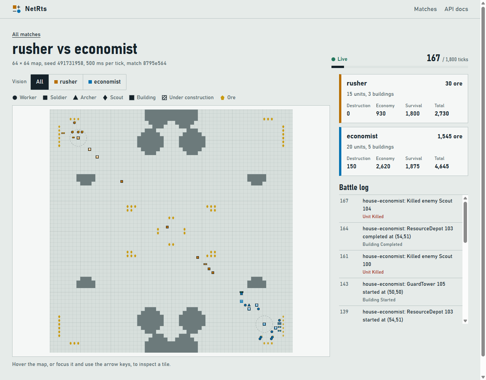
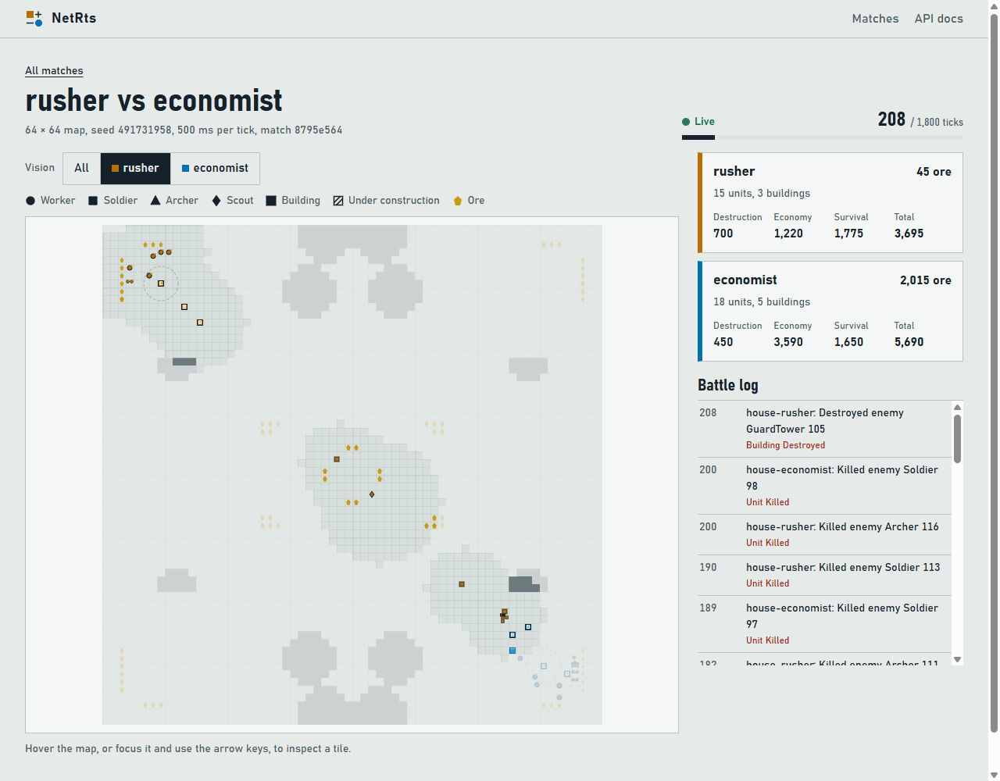

# 1. Start the server and look around

[← Tutorial index](README.md) · [Next: Talk to the API by hand →](02-talk-to-the-api.md)

Before writing any code, let's get a game running and watch two of the built-in *house bots*
fight. That way you'll know what your own bot is aiming for.

## Run the server

From the root of the NetRts repository:

```bash
dotnet run --project src/NetRts.Server
```

The first run compiles everything, so give it a minute. When you see

```text
Now listening on: http://localhost:5080
```

the server is up. Leave this terminal running and open a second one for the rest of the
tutorial. (Stop the server with Ctrl+C when you're done for the day.)

> **Why a server?** In NetRts the game lives on the server. It runs the world one *tick* at a
> time (one second per tick by default). Bots are separate programs that ask the server what
> they can see and send it orders. Your bot can be written in any language, run on any machine,
> and crash without breaking the game.

## The home page

Open <http://localhost:5080> in your browser (`dotnet run` may already have opened it for you).



- **Start an exhibition** pits two house bots against each other so you can watch.
- **Live matches** and **Recent results** list every game on this server, including the ones
  your bot plays later.
- **Leaderboard** ranks players by Elo rating.
- **API docs** (top right) is the interactive API reference; we'll use it on the next page.

## Watch an exhibition

Leave the form on `rusher` vs `economist` at *Normal* speed and press **Start match**. You're
taken to the match's spectate page:



What you're looking at:

- **The map** is a 64×64 grid. `(0, 0)` is the top-left corner. Grey blobs are rock, which
  nothing can walk through. Yellow pentagons are ore deposits.
- **Each player has a colour.** Rusher (orange) starts top left, economist (blue) bottom right.
  The dashed circle marks a starting Command Center.
- **Shapes tell you the unit type** (see the key above the map): circles are workers, squares
  soldiers, triangles archers, diamonds scouts. Filled squares with a letter are buildings.
- **The side panel** shows each player's ore, units, buildings and score, plus a battle log of
  important events.
- **Hover over any tile** to see exactly what's on it: ids, hit points, what a unit is doing.

Rusher skimps on its economy and attacks early with soldiers; economist builds a big economy and
defends with guard towers. Let it run for a minute and see who wins.

## Fog of war

Above the map, the **Vision** buttons switch between *All* (the spectator's view: everything)
and what a single player can actually see. Click **rusher**:



Only the areas around rusher's own units and buildings are clear. Everything else is *fogged*:
rusher knows the terrain there but not what's standing on it. **Your bot gets exactly this
view**, so it has to go and look before it can see the enemy.

## Recap

- The server runs the game; bots and browsers are clients.
- Matches advance one tick at a time.
- Each player sees only what its units and buildings can see.

[← Tutorial index](README.md) · [Next: Talk to the API by hand →](02-talk-to-the-api.md)
