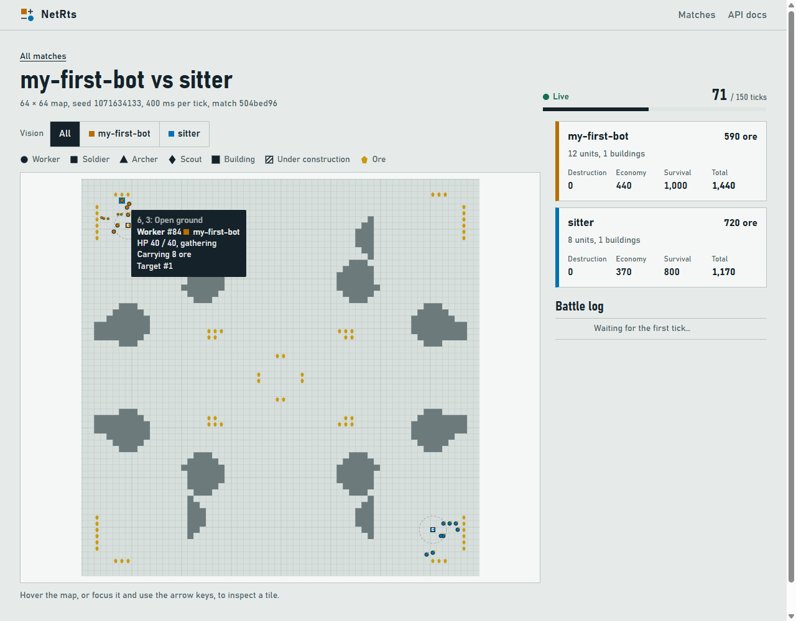
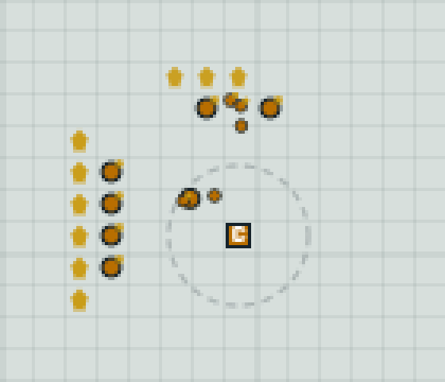

# 4. Put your workers to work

[← Previous: Your first bot](03-first-bot-loop.md) · [Tutorial index](README.md) · [Next: Build and train →](05-build-and-train.md)

Everything in Badger Brawl costs ore: workers, soldiers, buildings. So a bot's first job is an
**economy**: keep every worker mining, and make more workers. Full code:
[`code/step2_economy.cs`](code/step2_economy.cs) or [`code/step2_economy.py`](code/step2_economy.py).

## A decide function

Step 1's loop only looked. Now each tick we'll also **decide** what to do and **order** it. All
the thinking goes in one function, `Decide()` in C# and `decide()` in Python, that takes the
state and returns a list of commands:

```csharp
    while (state.Status != "Completed")
    {
        var commands = Decide(state);
        if (commands.Count > 0)
            await Send(matchId, commands);
        ...
    }
```

```python
    while state["status"] != "Completed":
        commands = decide(state)
        if commands:
            send(match_id, commands)
        ...
```

Keeping decisions in the decide function, apart from the HTTP code, means you can change your
strategy without touching the plumbing. `Send()` / `send()` posts the list and prints anything the
server rejects:

```csharp
// POST the commands and report any the server rejected straight away.
async Task Send(string matchId, List<Command> commands)
{
    var reply = await Api<CommandReply>("POST", $"/api/v1/matches/{matchId}/commands", new { commands });
    foreach (var result in reply.Results)
    {
        if (!result.Accepted)
        {
            var command = commands[result.Index];
            Console.WriteLine($"  rejected {command.Type}: {result.Error?.Code} - {result.Error?.Message}");
        }
    }
}
```

```python
def send(match_id, commands):
    """POST the commands and report any the server rejected straight away."""
    reply = api("POST", f"/api/v1/matches/{match_id}/commands", {"commands": commands})
    for result in reply["results"]:
        if not result["accepted"]:
            command = commands[result["index"]]
            print(f"  rejected {command['type']}: {result['error']['code']} - {result['error']['message']}")
```

## Idle workers go mining

On page 2 we sent all five workers to one deposit. That works, but they get in each other's way.
Your base has a field of about nine deposits, so it's better to spread out. For each idle worker,
pick the deposit that is close **and** has few miners already:

```csharp
List<Command> Decide(GameState state)
{
    int me = state.You.Slot;
    int ore = state.You.Resources;
    var workers = state.Units.Where(u => u.Owner == me && u.Type == "Worker").ToList();
    var commandCenter = state.Buildings.FirstOrDefault(b => b.Owner == me && b.Type == "CommandCenter");
    var commands = new List<Command>();

    // 1. Idle workers go mining. Count how many workers already mine each deposit and
    //    prefer close deposits with few miners, so the workers spread out.
    var deposits = state.Resources;  // only the deposits we can currently see
    if (deposits.Count > 0)
    {
        var miners = deposits.ToDictionary(d => d.Id, d => 0);
        foreach (var w in workers)
        {
            if (w.TargetId is int target && miners.ContainsKey(target))
                miners[target]++;
        }
        foreach (var w in workers)
        {
            if (w.Activity != "Idle")
                continue;
            var best = deposits.MinBy(d => Distance(w.X, w.Y, d.X, d.Y) + 3 * miners[d.Id])!;
            miners[best.Id]++;
            commands.Add(new Command("Gather", UnitIds: [w.Id], TargetId: best.Id));
        }
    }
```

```python
def decide(state):
    me = state["you"]["slot"]
    ore = state["you"]["resources"]
    workers = [u for u in state["units"] if u["owner"] == me and u["type"] == "Worker"]
    command_center = next((b for b in state["buildings"]
                           if b["owner"] == me and b["type"] == "CommandCenter"), None)
    commands = []

    # 1. Idle workers go mining. Count how many workers already mine each deposit and
    #    prefer close deposits with few miners, so the workers spread out.
    deposits = state["resources"]  # only the deposits we can currently see
    if deposits:
        miners = {d["id"]: 0 for d in deposits}
        for w in workers:
            if w["targetId"] in miners:
                miners[w["targetId"]] += 1
        for w in workers:
            if w["activity"] != "Idle":
                continue
            best = min(deposits, key=lambda d: distance(w["x"], w["y"], d["x"], d["y"]) + 3 * miners[d["id"]])
            miners[best["id"]] += 1
            commands.append({"type": "Gather", "unitIds": [w["id"]], "targetId": best["id"]})
```

Some things to notice:

- **Only idle workers get orders.** A worker told to `Gather` keeps mining and hauling ore home
  on its own, tick after tick. A new order always replaces the old one, so re-sending orders
  every tick at best wastes requests and at worst interrupts units halfway through a job. Giving
  orders only to units that need them is the most important habit in bot writing.
- A miner's `targetId` is the deposit it's working on, which is how we count miners per deposit.
- In C#, a command is a `Command` record: you name only the fields it needs, as in
  `new Command("Gather", UnitIds: [w.Id], TargetId: best.Id)`, and the fields you leave out
  aren't sent. In Python it's simply a dictionary.
- `Distance()` / `distance()` counts diagonal steps as one, which is how the game measures
  distance too:

  ```csharp
  static int Distance(int ax, int ay, int bx, int by) => Math.Max(Math.Abs(ax - bx), Math.Abs(ay - by));
  ```

  ```python
  def distance(ax, ay, bx, by):
      return max(abs(ax - bx), abs(ay - by))
  ```

- New workers pop out of the Command Center idle, so this same code puts them to work.

## Train more workers

More workers means more ore. The Command Center trains a worker for 50 ore in 8 ticks:

```csharp
    // 2. Train more workers, one or two at a time, until we have TargetWorkers.
    if (commandCenter is { Completed: true })
    {
        int queued = commandCenter.Production.Count;
        if (workers.Count + queued < TargetWorkers && queued < 2 && ore >= WorkerCost)
            commands.Add(new Command("Produce", BuildingId: commandCenter.Id, UnitType: "Worker"));
    }

    return commands;
}
```

```python
    # 2. Train more workers, one or two at a time, until we have TARGET_WORKERS.
    if command_center and command_center["completed"]:
        queued = len(command_center["production"])
        if len(workers) + queued < TARGET_WORKERS and queued < 2 and ore >= WORKER_COST:
            commands.append({"type": "Produce", "buildingId": command_center["id"], "unitType": "Worker"})

    return commands
```

`production` is the building's queue. We keep at most two in it, because ore spent on a queued
worker is locked up until it's built. A target of 12 workers (`TargetWorkers` in C#,
`TARGET_WORKERS` in Python) is enough to keep your base's ore field busy.
`commandCenter is { Completed: true }` is C# for "we have a Command Center and it's finished".

## Run it and watch

```bash
dotnet run step2_economy.cs -- --name my-first-bot --max-ticks 300     # C#
python step2_economy.py --name my-first-bot --max-ticks 300            # Python
```

```text
Match a0acb10e-a998-4082-ade7-0f36e659eb0e created against 'sitter'
Watch it at http://localhost:5080/#/match/a0acb10e-a998-4082-ade7-0f36e659eb0e
Started! We are slot 0 on a 64x64 map
tick    0: ore   500, 5 workers (5 idle)
tick   10: ore   350, 6 workers (0 idle)
tick   20: ore   360, 7 workers (0 idle)
...
tick   60: ore   520, 12 workers (0 idle)
...
tick  150: ore  1400, 12 workers (0 idle)
tick  160: ore  1500, 12 workers (0 idle)
tick  170: ore  1500, 12 workers (0 idle)
```

In the spectate page your workers spread out along the ore field:



Zoomed in on the base: the yellow fleck on a worker means it's carrying ore. Smaller circles are
workers sharing a tile.



Hover over a worker yourself to see its `activity` change between `gathering` and `returning`.

## Wait, the ore stopped at 1500?

Look at the end of that output. Ore is capped by your **storage capacity**: 1500 with one Command
Center (`you.storageCapacity` in the state). Anything mined beyond that is lost. A good economy is
no use if you don't **spend** it, and that's the next page.

> **Try it:** change `TargetWorkers` / `TARGET_WORKERS` to 6 or 20 and compare how fast ore comes in. Use
> `--tick-ms 200` to speed up testing.

## Recap

- Put strategy in a decide function that takes the state and returns commands.
- Only order units that need an order (here: idle workers).
- Spread workers over the deposits, and keep training workers up to a target.
- Ore piles up to your storage cap, then goes to waste.

[← Previous: Your first bot](03-first-bot-loop.md) · [Tutorial index](README.md) · [Next: Build and train →](05-build-and-train.md)
