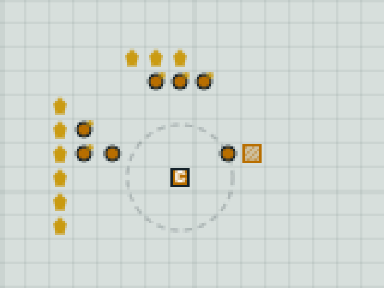
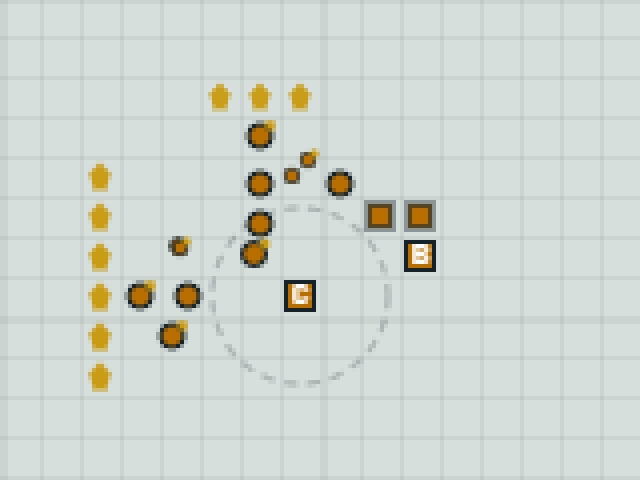

# 5. Build and train

[← Previous: Put your workers to work](04-put-workers-to-work.md) · [Tutorial index](README.md) · [Next: Attack and win →](06-attack-and-win.md)

Ore is piling up, so let's spend it on an army. Soldiers come from a **Barracks**, so the bot
has to choose a spot, send a worker to build it, then keep it busy training soldiers. Along the
way you'll meet the two ways a command can go wrong. Full code:
[`code/step3_army.cs`](code/step3_army.cs) or [`code/step3_army.py`](code/step3_army.py).

The numbers we need (all from the [bot guide](../bot-guide.md#game-rules), or live from
`GET /api/v1/rules`):

| | Cost | Time | Notes |
|---|---|---|---|
| Barracks | 150 ore | 40 worker-ticks | One worker builds it in 40 ticks, two in 20. |
| Soldier | 100 ore | 12 ticks | 110 HP, 9 damage, made at a Barracks. |

## Reading the map

To build, you need an open tile. The terrain never changes, so fetch it once when the match
starts with `GET /api/v1/matches/{id}/map`:

```csharp
    terrain = (await Api<MapInfo>("GET", $"/api/v1/matches/{matchId}/map")).Terrain;
```

```python
    terrain = api("GET", f"/api/v1/matches/{match_id}/map")["terrain"]
```

`terrain` is a list of strings, one per row, so `terrain[y][x]` is `'.'` for open ground or `'#'`
for rock. (The map also lists every player's start position. That's public knowledge.)

## Choosing a build site

A good spot is near your Command Center but **not** in the miners' path. A building plonked
between the ore and the Command Center makes every worker walk around it, forever. So we look at
every tile 3 to 6 steps from the Command Center, skip the bad ones and score the rest:

```csharp
// An open tile 3-6 tiles from the Command Center that doesn't get in the miners' way.
(int X, int Y)? FindBuildSite(Building commandCenter, GameState state)
{
    var taken = state.Buildings.Select(b => (b.X, b.Y)).ToHashSet();
    var ore = state.Resources.Select(d => (d.X, d.Y)).ToList();
    int cx = commandCenter.X, cy = commandCenter.Y;
    (int X, int Y)? best = null;
    int bestScore = 0;
    for (int y = cy - 6; y <= cy + 6; y++)
    {
        for (int x = cx - 6; x <= cx + 6; x++)
        {
            if (x < 0 || x >= state.MapWidth || y < 0 || y >= state.MapHeight)
                continue;  // off the map
            if (terrain[y][x] != '.' || taken.Contains((x, y)))
                continue;  // rock, or a building is already there
            int d = Distance(x, y, cx, cy);
            if (d < 3 || d > 6)
                continue;  // too close (blocks the CC) or too far
            int toOre = ore.Select(o => Distance(x, y, o.X, o.Y)).DefaultIfEmpty(99).Min();
            if (toOre <= 1)
                continue;  // on or right next to a deposit: workers need that space
            int score = d - Math.Min(toOre, 4);  // close to the CC, but away from the ore
            if (best is null || score < bestScore)
            {
                best = (x, y);
                bestScore = score;
            }
        }
    }
    return best;
}
```

```python
def find_build_site(command_center, state):
    """An open tile 3-6 tiles from the Command Center that doesn't get in the miners' way."""
    taken = {(b["x"], b["y"]) for b in state["buildings"]}
    ore = [(d["x"], d["y"]) for d in state["resources"]]
    cx, cy = command_center["x"], command_center["y"]
    best, best_score = None, None
    for y in range(cy - 6, cy + 7):
        for x in range(cx - 6, cx + 7):
            if not (0 <= x < state["mapWidth"] and 0 <= y < state["mapHeight"]):
                continue  # off the map
            if terrain[y][x] != "." or (x, y) in taken:
                continue  # rock, or a building is already there
            d = distance(x, y, cx, cy)
            if d < 3 or d > 6:
                continue  # too close (blocks the CC) or too far
            to_ore = min((distance(x, y, ox, oy) for ox, oy in ore), default=99)
            if to_ore <= 1:
                continue  # on or right next to a deposit: workers need that space
            score = d - min(to_ore, 4)  # close to the CC, but away from the ore
            if best is None or score < best_score:
                best, best_score = (x, y), score
    return best
```

## Ordering the build

```csharp
    // 1. Build one Barracks once 6 workers are mining. Until it exists, save ore for it.
    bool savingForBarracks = commandCenter is not null && barracks.Count == 0 && workers.Count >= 6;
    bool recentlyOrdered = barracksOrderedAt is not null && tick - barracksOrderedAt < 30;
    if (commandCenter is not null && savingForBarracks && !recentlyOrdered && budget >= BarracksCost)
    {
        if (FindBuildSite(commandCenter, state) is (int x, int y))
        {
            // The worker closest to the CC and not carrying ore makes the best builder.
            var builder = workers.MinBy(w => (w.Carrying, Distance(w.X, w.Y, commandCenter.X, commandCenter.Y)))!;
            commands.Add(new Command("Build", UnitIds: [builder.Id], BuildingType: "Barracks", X: x, Y: y));
            budget -= BarracksCost;
            barracksOrderedAt = tick;
            barracksBuilderId = builder.Id;
            workers.Remove(builder);  // don't send the builder off mining in step 2 below
        }
    }
```

```python
    # 1. Build one Barracks once 6 workers are mining. Until it exists, save ore for it.
    saving_for_barracks = command_center is not None and not barracks and len(workers) >= 6
    recently_ordered = barracks_ordered_at is not None and tick - barracks_ordered_at < 30
    if saving_for_barracks and not recently_ordered and budget >= COST["Barracks"]:
        site = find_build_site(command_center, state)
        if site:
            # The worker closest to the CC and not carrying ore makes the best builder.
            builder = min(workers, key=lambda w: (w["carrying"], distance(w["x"], w["y"],
                                                                          command_center["x"], command_center["y"])))
            commands.append({"type": "Build", "unitIds": [builder["id"]], "buildingType": "Barracks",
                             "x": site[0], "y": site[1]})
            budget -= COST["Barracks"]
            barracks_ordered_at = tick
            barracks_builder_id = builder["id"]
            workers.remove(builder)  # don't send the builder off mining in step 2 below
```

There's a lot packed in here, and each line is there for a reason:

- **`budget`** starts as your ore and goes down with every purchase we plan this tick. All the
  commands you send in one tick are checked against the *same* ore total, so without your own
  running total you'd happily order three things you can only afford one of.
- **`savingForBarracks`** (`saving_for_barracks` in Python): from 6 workers on, we stop training
  workers (see step 3 in the code) so the ore builds up to 150 instead of trickling away 50 at a
  time.
- **`workers.Remove(builder)`** (`workers.remove(builder)`): the builder is idle right now, so
  without this line the mining code below would send it a `Gather` in the same batch. *The most
  recent order wins*, so the builder would go mining instead.
- **`barracksOrderedAt`** (`barracks_ordered_at`) is memory that lasts between ticks. The worker needs a few ticks to
  walk to the site, and the Barracks doesn't appear in `buildings` (and the 150 ore isn't paid)
  until it breaks ground. Without this memory we'd order a new Barracks every tick until then.
  After 30 ticks without a Barracks we assume something went wrong and try again.

Variables like `terrain`, `barracksOrderedAt` and `barracksBuilderId` (`barracks_ordered_at` and
`barracks_builder_id` in Python) live outside any function, so they survive from one tick to the
next. In C#, the functions in the file can read and change them directly. In Python, a function
that changes them has to say so with `global`.

A few C# details in these snippets: `FindBuildSite()` returns a nullable tuple, `(int X, int Y)?`,
which is `null` when no tile fits, and `is (int x, int y)` both checks for that and unpacks the
tile. The `commandCenter is not null` test repeats part of `savingForBarracks`, but the C# compiler
needs to see it right there to be sure `commandCenter` isn't `null` inside the block. `MinBy` with a tuple, like Python's
`min` with a tuple key, picks the lowest `Carrying` first and breaks ties by distance.

## Training soldiers

Once the Barracks is finished, keep two soldiers in its queue:

```csharp
    // 4. Every finished Barracks keeps two Soldiers in its queue.
    foreach (var b in barracks)
    {
        if (b.Completed && b.Production.Count < 2 && budget >= SoldierCost)
        {
            commands.Add(new Command("Produce", BuildingId: b.Id, UnitType: "Soldier"));
            budget -= SoldierCost;
        }
    }
```

```python
    # 4. Every finished Barracks keeps two Soldiers in its queue.
    for b in barracks:
        if b["completed"] and len(b["production"]) < 2 and budget >= COST["Soldier"]:
            commands.append({"type": "Produce", "buildingId": b["id"], "unitType": "Soldier"})
            budget -= COST["Soldier"]
```

`b.Completed` (`b["completed"]`) matters: a Barracks under construction is in your `buildings` list too, but it
can't train anything until it's done.

## When commands go wrong

There are two kinds of failure, and a good bot watches for both.

**1. Rejected on arrival.** The server checks each command as soon as you send it. If it's
impossible right now (off the map, on rock, wrong building, not enough ore), it comes back in the
`results` with an error code, and `send()` prints it. For example, building on rock or asking a
Command Center for a soldier gives:

```text
  rejected Build: INVALID_SITE - Tile (26,0) is rock.
  rejected Produce: CANNOT_PRODUCE - CommandCenter cannot produce Soldier.
```

**2. Failed later.** An accepted command waits in a queue and runs on the next tick, and a Build
only *starts* when the worker reaches the site. By then things may have changed: you spent the
ore, or another building took the spot. Then you get a **`CommandFailed` event** in the state's
`events` list. Because we always pass `sinceTick`, each event arrives exactly once:

```csharp
// React to what happened since the last tick.
void HandleEvents(GameState state)
{
    foreach (var ev in state.Events)
    {
        if (ev.Kind == "CommandFailed")
        {
            // Accepted earlier, but it couldn't be carried out when the time came.
            Console.WriteLine($"tick {ev.Tick}: command failed: {ev.Message}");
            if (ev.EntityId == barracksBuilderId)
                barracksOrderedAt = null;  // our builder gave up: try again
        }
        else if (ev.Kind is "BuildingStarted" or "BuildingCompleted" or "UnitLost")
        {
            Console.WriteLine($"tick {ev.Tick}: {ev.Message}");
        }
    }
}
```

```python
def handle_events(state):
    """React to what happened since the last tick."""
    global barracks_ordered_at
    for event in state["events"]:
        if event["kind"] == "CommandFailed":
            # Accepted earlier, but it couldn't be carried out when the time came.
            print(f"tick {event['tick']}: command failed: {event['message']}")
            if event["entityId"] == barracks_builder_id:
                barracks_ordered_at = None  # our builder gave up: try again
        elif event["kind"] in ("BuildingStarted", "BuildingCompleted", "UnitLost"):
            print(f"tick {event['tick']}: {event['message']}")
```

When a Build fails on arrival, the event's `entityId` is the worker, which is why we remembered
the builder's id. Here's one we caused on purpose, by spending the ore while the builder was
still walking to a far-away site:

```text
tick 31: command failed: Cannot start Barracks at (27,27): Barracks costs 150; you have 140.
```

The bot forgets the order and tries again on a later tick. (A command that fails as it comes out
of the queue carries a `commandId` instead, matching the id you got back when you sent it.)

## Run it

```bash
dotnet run step3_army.cs -- --name my-first-bot --max-ticks 300     # C#
python step3_army.py --name my-first-bot --max-ticks 300            # Python
```

```text
Started! We are slot 0 on a 64x64 map
tick    0: ore   500, 5 workers, 0 soldiers
tick 8: worker 77 will build a Barracks at (10, 6)
tick   10: ore   400, 6 workers, 0 soldiers
tick 12: Barracks 79 started at (10,6)
tick   20: ore   200, 7 workers, 0 soldiers
...
tick 52: Barracks 79 completed at (10,6)
tick   60: ore   130, 12 workers, 0 soldiers
tick   70: ore   100, 12 workers, 1 soldiers
...
tick  200: ore   320, 12 workers, 12 soldiers
```

In the spectate page, a building under construction is drawn hatched, filling up as it
progresses. Here's the Barracks site at (10, 6), just after the builder broke ground, with the
builder standing next to it:



And a minute later, finished (the solid square marked **B**), with the first two soldiers (the
squares without a letter) standing beside it:



The soldiers just stand there for now. Let's give them something to do.

## Recap

- Fetch the terrain once from `/map`; `terrain[y][x]` is `'.'` or `'#'`.
- Place buildings near home but out of the miners' way.
- Track your own `budget` within a tick, and remember orders across ticks.
- Rejections come back immediately in `results`; later failures arrive as `CommandFailed` events.

[← Previous: Put your workers to work](04-put-workers-to-work.md) · [Tutorial index](README.md) · [Next: Attack and win →](06-attack-and-win.md)
