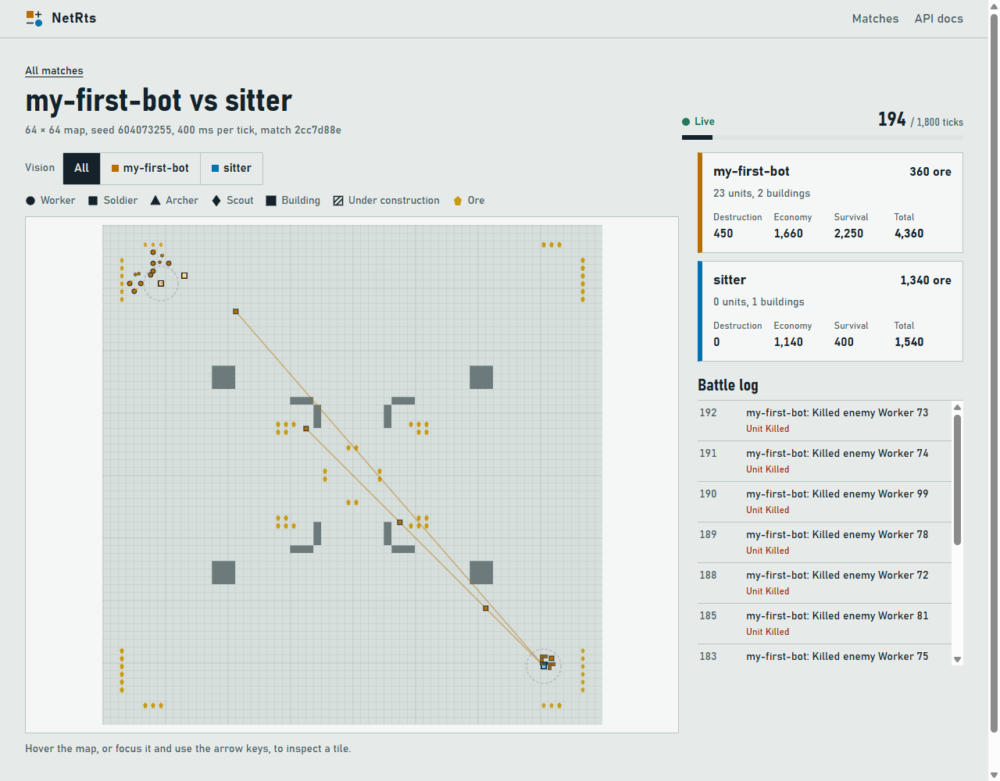
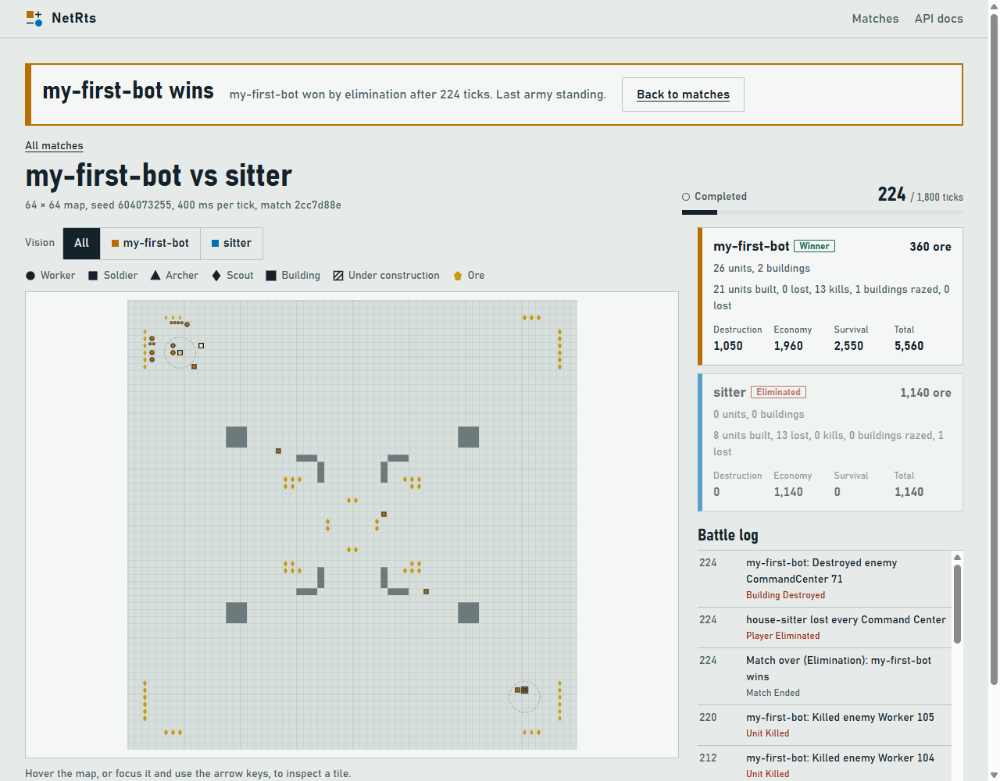

# 6. Attack and win

[← Previous: Build and train](05-build-and-train.md) · [Tutorial index](README.md) · [Next: Where next →](07-where-next.md)

You have an economy and an army. The last piece: send the army to the enemy base and destroy it.
Full code: [`code/step4_attack.cs`](code/step4_attack.cs) or
[`code/step4_attack.py`](code/step4_attack.py). This is the finished tutorial bot.

## How you win

A player who has **no Command Center left** is eliminated, and the last player standing wins. (If
nobody is eliminated before `maxTicks`, the highest score wins instead.) `sitter` has exactly one
Command Center, sitting at its `startPosition`. So the plan is: march there and knock it down.

## Where is the enemy?

You can't see the enemy base through the fog, but you don't need to. Every player's
`startPosition` is in the state, and that's where their Command Center was built:

```csharp
// Start position of the first opponent still in the game: its Command Center is there.
(int X, int Y) EnemyBase(GameState state)
{
    int me = state.You.Slot;
    foreach (var p in state.Players)
    {
        if (p.Slot != me && !p.Eliminated)
            return (p.StartPosition.X, p.StartPosition.Y);
    }
    return (state.MapWidth / 2, state.MapHeight / 2);
}
```

```python
def enemy_base(state):
    """Start position of the first opponent still in the game: its Command Center is there."""
    me = state["you"]["slot"]
    for p in state["players"]:
        if p["slot"] != me and not p["eliminated"]:
            return p["startPosition"]["x"], p["startPosition"]["y"]
    return state["mapWidth"] // 2, state["mapHeight"] // 2
```

## The attack

Two kinds of `Attack` order are useful here:

- **Attack a target**: `{"type": "Attack", "unitIds": [...], "targetId": 71}` chases that one
  enemy until it dies (or disappears into the fog).
- **Attack-move**: `{"type": "Attack", "unitIds": [...], "x": 56, "y": 56}` walks to a tile and
  fights anything it meets along the way. A plain `Move` would walk straight past enemies, even
  while they're shooting at you.

```csharp
    // 5. Attack! Wait until we have AttackWith soldiers, then never stop: every soldier
    //    that is idle (new from the Barracks, or its target died) gets a new order.
    var soldiers = state.Units.Where(u => u.Owner == me && u.Type == "Soldier").ToList();
    if (soldiers.Count >= AttackWith)
        attacking = true;
    var idleSoldiers = soldiers.Where(s => s.Activity == "Idle").ToList();
    if (attacking && idleSoldiers.Count > 0)
    {
        int[] ids = idleSoldiers.Select(s => s.Id).ToArray();
        // Enemy units and buildings we can see right now (fog of war hides the rest).
        var enemies = state.Units.Where(u => u.Owner != me).Select(u => (u.Id, u.X, u.Y))
            .Concat(state.Buildings.Where(b => b.Owner != me).Select(b => (b.Id, b.X, b.Y)))
            .ToList();
        if (enemies.Count > 0)
        {
            var leader = idleSoldiers[0];
            var target = enemies.MinBy(e => Distance(leader.X, leader.Y, e.X, e.Y));
            commands.Add(new Command("Attack", UnitIds: ids, TargetId: target.Id));
        }
        else
        {
            // Attack-move: walk to the enemy base, fighting anything seen on the way.
            var (x, y) = EnemyBase(state);
            commands.Add(new Command("Attack", UnitIds: ids, X: x, Y: y));
        }
    }
```

```python
    # 5. Attack! Wait until we have ATTACK_WITH soldiers, then never stop: every soldier
    #    that is idle (new from the Barracks, or its target died) gets a new order.
    soldiers = [u for u in state["units"] if u["owner"] == me and u["type"] == "Soldier"]
    if len(soldiers) >= ATTACK_WITH:
        attacking = True
    idle_soldiers = [s for s in soldiers if s["activity"] == "Idle"]
    if attacking and idle_soldiers:
        ids = [s["id"] for s in idle_soldiers]
        # Enemy units and buildings we can see right now (fog of war hides the rest).
        enemies = [e for e in state["units"] + state["buildings"] if e["owner"] != me]
        if enemies:
            leader = idle_soldiers[0]
            target = min(enemies, key=lambda e: distance(leader["x"], leader["y"], e["x"], e["y"]))
            commands.append({"type": "Attack", "unitIds": ids, "targetId": target["id"]})
        else:
            # Attack-move: walk to the enemy base, fighting anything seen on the way.
            x, y = enemy_base(state)
            commands.append({"type": "Attack", "unitIds": ids, "x": x, "y": y})
```

Why it's written this way:

- **Wait for a group.** Soldiers that walk in one at a time get picked off one at a time. With
  six (`AttackWith` / `ATTACK_WITH`) the first wave arrives together. After that, `attacking`
  stays true and each new soldier heads off as soon as it's trained.
- **One list of enemies.** Units and buildings come in separate lists. Python can just add them
  together. In C# they're different record types, so we keep only what we need from each (id
  and position, as a tuple) and join the two lists with `Concat`.
- **Only idle soldiers get orders**, the same habit as with the workers. A soldier that's walking
  or fighting already has something to do. When its target dies it goes idle and gets a new one.
- **Closest visible enemy first, otherwise attack-move to the base.** On the way, the army sees
  nothing and attack-moves. Once enemies appear in its vision, it picks them off nearest-first,
  and the Command Center falls with everything else.

## Reading the result

When `status` becomes `Completed`, the loop ends and the bot asks for the result:

```csharp
// GET /result: the winner, why the match ended, and everyone's score and stats.
async Task PrintResult(string matchId)
{
    var result = await Api<MatchResult>("GET", $"/api/v1/matches/{matchId}/result");
    var outcome = result.Outcome;
    string winner = result.Players.FirstOrDefault(p => p.Winner)?.Name ?? "nobody (draw)";
    Console.WriteLine($"\nMatch over after {outcome.Ticks} ticks ({outcome.Reason}). Winner: {winner}");
    foreach (var p in result.Players)
    {
        var score = p.Score;
        Console.WriteLine($"  {p.Name,-16} score {score.Total,6}  " +
                          $"(destruction {score.Destruction}, economy {score.Economy}, survival {score.Survival})" +
                          $"  units made {p.UnitsProduced}, lost {p.UnitsLost}, killed {p.UnitsKilled}");
    }
}
```

```python
def print_result(match_id):
    """GET /result: the winner, why the match ended, and everyone's score and stats."""
    result = api("GET", f"/api/v1/matches/{match_id}/result")
    outcome = result["outcome"]
    winner = next((p["name"] for p in result["players"] if p["winner"]), "nobody (draw)")
    print(f"\nMatch over after {outcome['ticks']} ticks ({outcome['reason']}). Winner: {winner}")
    for p in result["players"]:
        score = p["score"]
        print(f"  {p['name']:<16} score {score['total']:>6}  "
              f"(destruction {score['destruction']}, economy {score['economy']}, survival {score['survival']})"
              f"  units made {p['unitsProduced']}, lost {p['unitsLost']}, killed {p['unitsKilled']}")
```

`outcome.reason` is `Elimination`, `TimeLimit` or `Surrender`. The score adds up three things:
**destruction** (ore value of enemy stuff you destroyed), **economy** (ore you mined) and
**survival** (ore value of everything you still have). It decides the winner when time runs out.

## Run it

```bash
dotnet run step4_attack.cs -- --name my-first-bot     # C#
python step4_attack.py --name my-first-bot            # Python
```

At the default speed of one tick per second this takes about four minutes. (Add `--tick-ms 200`
if you're impatient.)

```text
Started! We are slot 0 on a 64x64 map
tick    0: ore   500, 5 workers, 0 soldiers
tick 8: worker 77 will build a Barracks at (10, 6)
tick 12: Barracks 79 started at (10,6)
...
tick 52: Barracks 79 completed at (10,6)
...
tick  130: ore   200, 12 workers, 6 soldiers
...
tick 224: Destroyed enemy CommandCenter 71
tick 224: house-sitter lost every Command Center

Match over after 224 ticks (Elimination). Winner: my-first-bot
  my-first-bot     score   5560  (destruction 1050, economy 1960, survival 2550)  units made 21, lost 0, killed 13
  house-sitter     score   1140  (destruction 0, economy 1140, survival 0)  units made 8, lost 13, killed 0
```

In the spectate page, the soldiers stream diagonally across the map. The thin lines show each
soldier's current target: the first wave is already in sitter's base, with reinforcements on
the way.



A few seconds later the Command Center falls and the match ends:



The side panel now shows each player's totals (units built, lost and killed), the same numbers
`/result` gave your bot. Your bot is also on the home page's leaderboard: a 1v1 game that
includes a non-house player is rated.

Congratulations: that's a complete NetRts bot! It reliably beats `sitter`, usually in about
225 to 235 ticks.

## Recap

- Eliminate the enemy by destroying every Command Center; `startPosition` tells you where to go.
- Attack-move to a position, or attack a specific `targetId`.
- Gather a group before attacking, then keep reinforcing.
- `GET /result` gives the winner, the reason and a score breakdown.

[← Previous: Build and train](05-build-and-train.md) · [Tutorial index](README.md) · [Next: Where next →](07-where-next.md)
